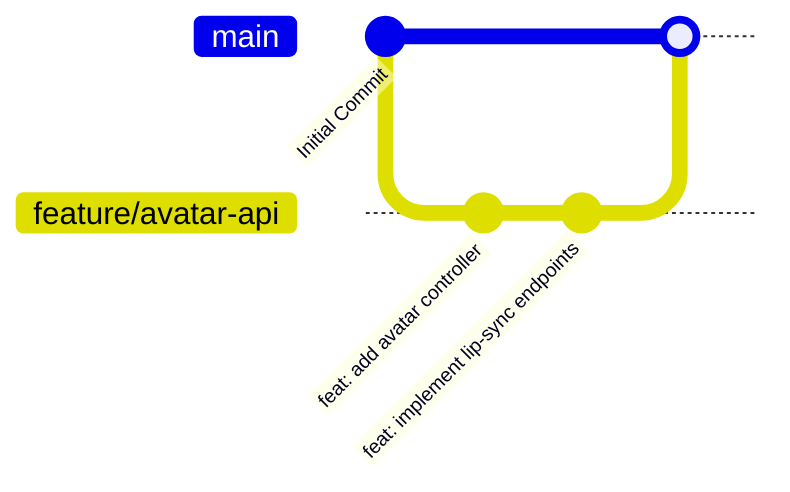

# Team Workflow and Git Guidelines

This document details the day-to-day workflow for the Hybrid Video LMS development team.

---

## 1. Developer Daily Loop



### Steps:
1. **Sync Upstream:** Keep your local `main` branch synced with the upstream repository.
   ```bash
   git checkout main
   git pull upstream main
   ```
2. **Branch Creation:** Always work in branch types (`feature/`, `bugfix/`, `docs/`).
   ```bash
   git checkout -b feature/<your-assigned-feature>
   ```
3. **Commit Messages:** Commit often, using conventional prefixes:
   * `feat: ...` for new features.
   * `fix: ...` for bugs.
   * `docs: ...` for documentation changes.
   * `test: ...` for adding or modifying tests.
   * `refactor: ...` for code optimization or cleanup.
4. **Local Testing:** Run quality checks (linting/tests) locally:
   * Run code formatting validation.
   * Run target test suites.

---

## 2. Review and Merge Policy

* **Demo Video Requirement:** Every pull request requires a link to a **2-5 minute video demo** recorded by the developer, showcasing that the features actually run as expected.
* **No Direct Merges:** Maintainers/Reviews are the only ones allowed to approve and squash-merge the branch once reviews pass.
* **Issue Link:** Write `Closes #<issue_id>` in the PR body to automatically link and close issues.
