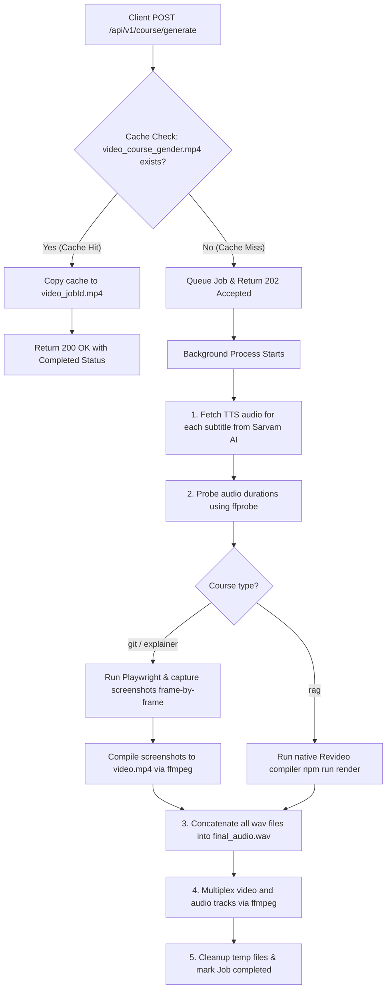

# Animation Service

The **Animation Service** is a high-performance headless rendering and web server for the Hybrid Video LMS project. It parses animation timeline descriptions and subtitle structures to generate synchronized, voice-narrated educational videos using HTML5 layouts, Playwright, FFmpeg, and native Revideo compilations.

---

## Architecture Overview

The service operates on a **dual-pipeline rendering architecture** configured for both headless browser automation and programmatic React-based animation compilers, integrated with external speech APIs and caching mechanisms.



### 1. Dual-Pipeline Rendering
- **Playwright Headless Screen-Capturer** (used for `git` and `explainer` courses): Uses a headless Chromium instance to navigate to the player's web URL, override timelines using generated TTS audio durations, step through playback frame-by-frame (calling the page's global `renderFrame(t)` function), screenshot the `#video-canvas` element, and compile the frames with FFmpeg.
- **Native Revideo compiler** (used for `rag` course): Runs `npm run render` inside the RAG template directory, compiling the TypeScript scenes defined under `templates/rag/src/scenes` directly using the `@revideo/renderer` and `@revideo/core` libraries.

### 2. Audio Generation & Voice Mapping
Voice narration is generated dynamically using the **Sarvam AI Text-to-Speech API** (`https://api.sarvam.ai/text-to-speech`) with the `bulbul:v3` model and `en-IN` target language. Celebrities passed in the request body are automatically mapped to specialized speakers:
* **Shahrukh Khan (`shahrukh`, `srk`, etc.)** $\rightarrow$ Speaker: `aditya` (Male)
* **NTR Jr (`ntr`, `jrntr`, etc.)** $\rightarrow$ Speaker: `shubh` (Male)
* **Others / Defaults** $\rightarrow$ Speaker: `aditya`

Gender is detected by checking if the celebrity name contains any matching substrings: `['deepika', 'priyanka', 'katrina', 'alia', 'madhuri', 'kareena', 'shraddha', 'rashmika', 'nayanthara', 'female', 'aruna']`. If a match is found, the system registers the gender as `'female'`, otherwise it defaults to `'male'`.

### 3. Caching Strategy
To optimize response times and conserve API credits, the service checks for pre-rendered video templates named `video_${course}_${gender}.mp4` in the `public/outputs/` directory.
- **Cache Hit**: If a matching template exists, the service copies it to the job-specific file immediately, registers the job status as `completed`, and returns the final video path instantly in the initial API response (`200 OK`).
- **Cache Miss**: If the file is missing, the service responds with `202 Accepted` and kicks off the background rendering queue (generating TTS, probing audio, taking screenshots, and multiplexing tracks).

---

## File Structure

```
animation-service/
├── Dockerfile                         # Environment configuration for Puppeteer, Chromium, and FFmpeg
├── package.json                       # Service dependencies and scripts
├── export_video.js                    # Standalone CLI renderer using Playwright and FFmpeg
├── generate_audio.js                  # Standalone CLI utility for generating TTS steps via Sarvam API
├── get_durations.js                   # CLI tool to extract audio file durations using ffprobe
├── extract_rag_subtitles.js           # Extracts subtitle scripts from RAG templates
├── write_script.js                    # Utility script to inject timeline data into public player
├── test_endpoints.js                  # End-to-end API automation test runner
├── generate_female_cache.js           # CLI script to trigger and cache all female course videos
├── src/                               # Main source files
│   ├── index.js                       # Express web application server and render manager
│   ├── subtitles.js                   # Timeline subtitles for Git course (61 steps)
│   ├── explainer_subtitles.js         # Documented subtitles for Explainer course (33 steps)
│   ├── rag_subtitles.js               # Subtitle scripts for RAG course (25 steps)
│   └── project.ts                     # TypeScript model definition
├── public/                            # Static assets and player source files
│   ├── index.html                     # HTML player container for Git course
│   ├── style.css                      # Styling for the cinematic visualizer
│   ├── script.js                      # Core playback timeline engine
│   ├── error_page.png                 # Fallback screenshot image
│   ├── explainer/                     # Static build files for Explainer course React app
│   ├── assets/                        # Storage for generated audio files and temp frames
│   └── outputs/                       # Storage for output MP4 files & pre-rendered cached videos
├── templates/                         # Templates folder containing raw project files
│   ├── rag/                           # Native Revideo project for RAG course
│   └── explainer/                     # React/Vite source code for Explainer course
└── tests/                             # Test directory
    └── index.test.js                  # Test suite file
```

### Critical File References
* [src/index.js](file:///home/pro/hybrid-video-lms/services/animation-service/src/index.js): Express app entrypoint containing routes and rendering pipelines.
* [src/subtitles.js](file:///home/pro/hybrid-video-lms/services/animation-service/src/subtitles.js): Narrative script segments for the Git internals course.
* [src/explainer_subtitles.js](file:///home/pro/hybrid-video-lms/services/animation-service/src/explainer_subtitles.js): Subtitle definitions for the LMS Explainer course.
* [src/rag_subtitles.js](file:///home/pro/hybrid-video-lms/services/animation-service/src/rag_subtitles.js): Extracted subtitles for the Retrieval-Augmented Generation course.
* [public/index.html](file:///home/pro/hybrid-video-lms/services/animation-service/public/index.html): HTML5 canvas frame container.
* [public/script.js](file:///home/pro/hybrid-video-lms/services/animation-service/public/script.js): Script that controls drawing visual frames using canvas states.
* [templates/rag/src/project.tsx](file:///home/pro/hybrid-video-lms/services/animation-service/templates/rag/src/project.tsx): Configuration file for RAG scenes.
* [templates/rag/src/render.ts](file:///home/pro/hybrid-video-lms/services/animation-service/templates/rag/src/render.ts): Main rendering execution for Revideo.
* [export_video.js](file:///home/pro/hybrid-video-lms/services/animation-service/export_video.js): Offline CLI utility for manual video composition.
* [test_endpoints.js](file:///home/pro/hybrid-video-lms/services/animation-service/test_endpoints.js): End-to-end API endpoint tests.
* [generate_female_cache.js](file:///home/pro/hybrid-video-lms/services/animation-service/generate_female_cache.js): CLI script to trigger and cache all female course videos.

---

## System Requirements

The service requires the following system binaries to perform headless browser screenshotting and video assembly:
1. **Node.js**: v18+
2. **FFmpeg**: Compiled with `libx264` and `aac` support.
3. **FFprobe**: Bundled with FFmpeg to parse audio file parameters.
4. **Chromium / Playwright Dependencies**: Shared system libraries for headless browser viewport rendering (managed automatically inside [Dockerfile](file:///home/pro/hybrid-video-lms/services/animation-service/Dockerfile)).

---

## Configuration

Environment variables can be set in a `.env` file in this directory or passed directly to the shell:

| Environment Variable | Description | Default Value |
| :--- | :--- | :--- |
| `PORT` | Web server port | `3000` |
| `SARVAM_API_KEY` | Subscription key for Sarvam AI Text-to-Speech | `sk_y25zfvvc_WhWlL0w3VjvolJikQyqJnHL0` |

---

## API Documentation

### 1. Service Health Check
Verify if the service is up and running.

* **URL**: `/health`
* **Method**: `GET`
* **Response Status**: `200 OK`
* **Response Body**:
  ```json
  {
    "name": "Animation Service",
    "status": "healthy"
  }
  ```

### 2. Generate Course Video
Initiates video composition for a specified course narrated by a celebrity voice.

* **URL**: `/api/v1/course/generate`
* **Method**: `POST`
* **Headers**: `Content-Type: application/json`
* **Request Body Parameters**:
  - `celebrity` (string, **required**): The name of the celebrity used for voice mapping (e.g., `"shahrukh"`, `"srk"`, `"ntr"`, `"alia"`, etc.).
  - `course` (string, **optional**): The course timeline to render. Supported courses: `"git"`, `"rag"`, or `"explainer"`. Defaults to `"git"`.
  - `gender` (string, **optional**): Force a specific voice gender (`"male"` or `"female"`). If set to `"auto"`, omitted, or invalid, the service will dynamically infer the gender from the celebrity name.

* **Scenario A: Cache Hit (Instant Video Creation)**
  * **Response Status**: `200 OK`
  * **Response Body**:
    ```json
    {
      "job_id": "job_1a2b3c4d",
      "status": "completed",
      "course": "git",
      "gender": "male",
      "created_at": "2026-07-15T15:00:00.000Z",
      "completed_at": "2026-07-15T15:00:01.000Z",
      "output_url": "/outputs/video_job_1a2b3c4d.mp4",
      "check_status_url": "/api/v1/course/jobs/job_1a2b3c4d",
      "message": "Pre-rendered video for 'git' (male) loaded instantly."
    }
    ```

* **Scenario B: Cache Miss (Background Queue Triggered)**
  * **Response Status**: `202 Accepted`
  * **Response Body**:
    ```json
    {
      "job_id": "job_5e6f7g8h",
      "status": "queued",
      "course": "git",
      "created_at": "2026-07-15T15:00:00.000Z",
      "check_status_url": "/api/v1/course/jobs/job_5e6f7g8h",
      "message": "Celebrity course video rendering job for 'git' successfully queued."
    }
    ```

### 3. Check Rendering Job Status
Retrieves execution state, pipeline progress, and output metadata for a queued job.

* **URL**: `/api/v1/course/jobs/:jobId`
* **Method**: `GET`
* **URL Params**: `jobId` - The unique identifier returned by the generation endpoint (e.g. `job_5e6f7g8h`).
* **Response Status**: `200 OK` / `404 Not Found`
* **Response Body (In-Progress / Rendering)**:
  ```json
  {
    "job_id": "job_5e6f7g8h",
    "celebrity": "shahrukh",
    "course": "git",
    "gender": "male",
    "speaker": "aditya",
    "language_code": "en-IN",
    "status": "rendering_frames",
    "progress": 55,
    "created_at": "2026-07-15T15:00:00.000Z",
    "completed_at": null,
    "output_url": null
  }
  ```
* **Response Body (Completed)**:
  ```json
  {
    "job_id": "job_5e6f7g8h",
    "celebrity": "shahrukh",
    "course": "git",
    "gender": "male",
    "speaker": "aditya",
    "language_code": "en-IN",
    "status": "completed",
    "progress": 100,
    "created_at": "2026-07-15T15:00:00.000Z",
    "completed_at": "2026-07-15T15:04:12.345Z",
    "output_url": "/outputs/video_job_5e6f7g8h.mp4"
  }
  ```

#### Job Lifecycle States:
1. `queued`: Initial queue assignment.
2. `generating_audio`: Fetching TTS fragments from Sarvam AI.
3. `probing_durations`: Parsing `.wav` metadata using `ffprobe`.
4. `rendering_frames`: Capturing screen frames using Playwright.
5. `compiling_video`: Merging frames to MP4 using FFmpeg.
6. `compiling_audio`: Concatenating WAV files using FFmpeg.
7. `multiplexing`: Packaging video and audio streams.
8. `completed` / `failed`: Final terminating status.

### 4. Stream or Download Video File
Directly fetch the generated `.mp4` video binary.

* **URL**: `/api/v1/course/download/:jobId`
* **Method**: `GET`
* **URL Params**: `jobId` - The unique identifier of the completed job.
* **Response Status**: `200 OK` (Streams the file) / `404 Not Found` (Job not found or file not compiled on disk) / `400 Bad Request` (Job in progress).

---

## Testing & Command Execution

Here is how you can test the courses and verify the animation rendering flow.

### 1. Launching the Web Server
Start the Express server locally:
```bash
# In services/animation-service
npm run dev
```

### 2. Testing via Developer Sandbox Web UI (Recommended)
An interactive developer sandbox web interface is provided to trigger render runs, view live terminal logs, and watch output clips without using curl or CLI scripts.
1. Ensure the server is running (`npm run dev`).
2. Open your web browser and navigate to [http://localhost:3000/test.html](http://localhost:3000/test.html).
3. Select the course timeline, configure the target celebrity voice narrator, and click **Queue Animation Render**.
4. The panel will display real-time rendering status and logs, and will load the completed video player when finished.

### 3. Testing via Automatic Script
Run the automated validation pipeline which spawns the server, makes a job queue request, polls the status, displays progress updates, and terminates clean:
```bash
node test_endpoints.js
```

### 4. Testing with `curl` Commands

#### Step A: Submit a generation request
Use `curl` to send a POST request. You can request any of the three courses: `git`, `rag`, or `explainer`.

* **Git Course (Celebrity voice: Shahrukh Khan)**
  ```bash
  curl -X POST http://localhost:3000/api/v1/course/generate \
       -H "Content-Type: application/json" \
       -d '{"celebrity": "shahrukh", "course": "git"}'
  ```

* **RAG Course (Celebrity voice: Alia Bhatt - triggers Female voice/cache)**
  ```bash
  curl -X POST http://localhost:3000/api/v1/course/generate \
       -H "Content-Type: application/json" \
       -d '{"celebrity": "alia", "course": "rag"}'
  ```

* **Explainer Course (Celebrity voice: NTR Jr)**
  ```bash
  curl -X POST http://localhost:3000/api/v1/course/generate \
       -H "Content-Type: application/json" \
       -d '{"celebrity": "ntr", "course": "explainer"}'
  ```

* **Expected Response (Cache Miss Example):**
  ```json
  {
    "job_id": "job_ef494fff",
    "status": "queued",
    "course": "git",
    "created_at": "2026-07-15T15:00:00.000Z",
    "check_status_url": "/api/v1/course/jobs/job_ef494fff",
    "message": "Celebrity course video rendering job for 'git' successfully queued."
  }
  ```

#### Step B: Poll Job Status
Use the `check_status_url` returned from the POST request:
```bash
curl -X GET http://localhost:3000/api/v1/course/jobs/job_ef494fff
```
* **Expected Response:**
  ```json
  {
    "job_id": "job_ef494fff",
    "celebrity": "shahrukh",
    "course": "git",
    "gender": "male",
    "speaker": "aditya",
    "language_code": "en-IN",
    "status": "rendering_frames",
    "progress": 62,
    "created_at": "2026-07-15T15:00:00.000Z",
    "completed_at": null,
    "output_url": null
  }
  ```

#### Step C: Download/Verify Output
Once the status is marked `completed` and progress reaches `100`, download the video stream to your local file system:
```bash
curl -o output_video.mp4 http://localhost:3000/api/v1/course/download/job_ef494fff
```

---

## Offline Rendering Scripts

You can also run rendering tasks manually outside of the server environment:

- **Rebuild Client Player Data**:
  If the visualizer step descriptions in [write_script.js](file:///home/pro/hybrid-video-lms/services/animation-service/write_script.js) are edited, write the updates back into the client player JS file:
  ```bash
  node write_script.js
  ```

- **Generate Subtitles**:
  To parse all TypeScript scene components from the RAG template and generate synchronized JSON/JS scripts:
  ```bash
  node extract_rag_subtitles.js
  ```

- **Render Offline Video via Playwright**:
  To directly render the player running on localhost:3000 to an `output.mp4` file offline without using API queues:
  ```bash
  node export_video.js
  ```

- **Running Server Unit Tests**:
  Verify the environment and assertions:
  ```bash
  npm run test
  ```

---

## Customizing Courses & Timeline Sync

If you want to customize the scripts, add scenes, or fine-tune audio-visual synchronization, follow these guidelines:

### 1. How Timeline Synchronization Works
For the `git` and `explainer` courses:
- **Duration Probing**: When a video generation request is received, the backend generates WAV files for each step. It uses `ffprobe` to determine the exact duration of each narration file and adds a `0.4-second` padding to prevent words from being cut off.
- **Dynamic Overrides**: These durations are passed to the client-side canvas player. The player aggregates them to determine the exact start time of each step and the overall video length.
- **Visual Scaling**: Within [public/script.js](file:///home/pro/hybrid-video-lms/services/animation-service/public/script.js), animations (like typing a command, drawing a staging arrow, or adding a commit node) are coded using percentage-based ratios of the active step's duration (e.g., `relativeTime < stepDuration * 0.4`).
- **Auto-Sync**: Because the visuals are bound to these ratios, if the voice output is longer or shorter (e.g., due to different languages, speakers, or revised text), the visual animations **automatically scale and sync** without manual alignment.

### 2. Modifying or Adding New Steps
To update subtitle text or add new steps to the `git` course:
1. Edit the array of strings in [src/subtitles.js](file:///home/pro/hybrid-video-lms/services/animation-service/src/subtitles.js) (or [src/explainer_subtitles.js](file:///home/pro/hybrid-video-lms/services/animation-service/src/explainer_subtitles.js)).
2. Update the corresponding steps metadata in [write_script.js](file:///home/pro/hybrid-video-lms/services/animation-service/write_script.js) (such as commands, expected console outputs, and internal visual logs).
3. Run the compiler script to rebuild the player's timelines:
   ```bash
   node write_script.js
   ```
4. Define the drawing or state-rendering logic for your new steps inside the `renderFrame(time)` step switch block in [public/script.js](file:///home/pro/hybrid-video-lms/services/animation-service/public/script.js).

For the `rag` course (which uses native Revideo):
1. Create or edit TSX scene components inside [templates/rag/src/scenes/](file:///home/pro/hybrid-video-lms/services/animation-service/templates/rag/src/scenes).
2. Register the scenes in the scene array in [templates/rag/src/project.tsx](file:///home/pro/hybrid-video-lms/services/animation-service/templates/rag/src/project.tsx).
3. Regenerate the subtitles lists by running:
   ```bash
   node extract_rag_subtitles.js
   ```

### 3. Fine-Tuning Frame Sync & Enhancing Visuals
If a visual transition happens too early or too late relative to the spoken narration:
- Open [public/script.js](file:///home/pro/hybrid-video-lms/services/animation-service/public/script.js).
- Locate the step drawing logic inside the switch block.
- Adjust the timing ratio (e.g., change `stepDuration * 0.4` to `0.3` for earlier transitions, or `0.6` for later ones).
- Alternatively, you can use absolute time gates (e.g., `relativeTime < 3.0` seconds) to keep elements visible for fixed durations regardless of speech length.
